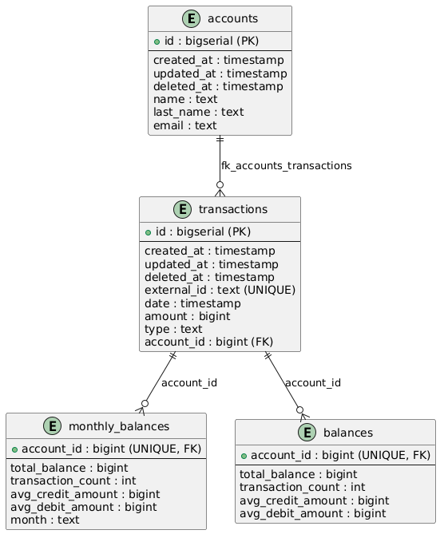
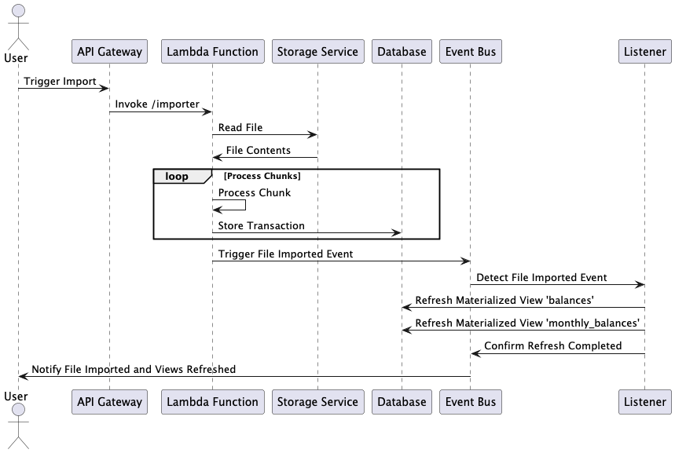
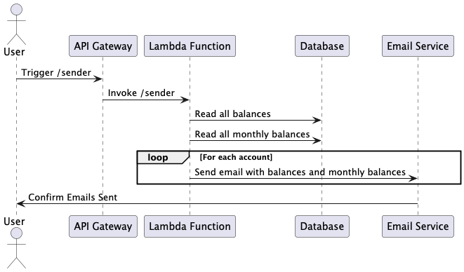
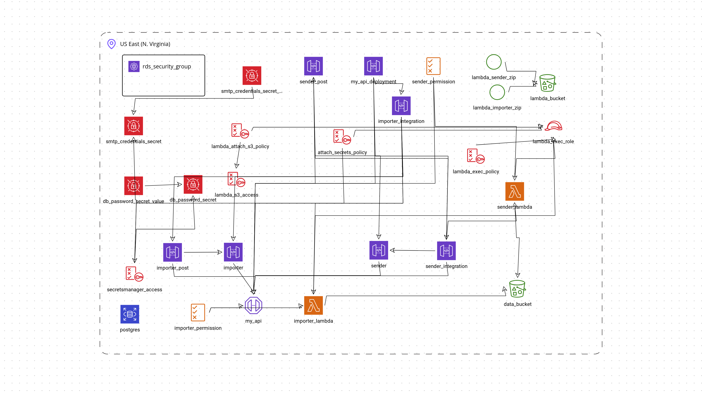

# Stori

### Architecture

The application is divided into two main components:

## Importer

The importer will read the transactions from a file and will save the transactions
into the DB.

## Sender

The sender will read the `balances` and `monthly_balances` and will send this information to
the users.
------

## How to run

### Local

`.env` file is needed to run the application. You can copy the `.env.example` file and rename it to `.env`.

Start the services needed for the application to run.

This will create the follows services:

* Database postgresql
* An SMTP server to mock emails local
* A localstack to emulate AWS services

```bash
docker-compose up -d
```

Build dockers for both binaries

```bash
make dockers
```

This will run the importer locally using the local reader

```bash
make run-importer volume="$(pwd)/internal/accounts/transactions/importer/fixtures/random_transactions.csv:/app/transactions.csv" file=transactions.csv mode=local
```

This will run the importer reading the file from S3

```bash
make run-importer file="random_transactions.csv" mode=s3
```

This will run the sender

```bash
make run-sender
```

------

### Endpoints

#### 1. `/importer` (POST)

- **Descripción**: Starts the import process of a CSV file containing transactions.
- **Params**:
    - `file_path` (string): Path to the .
- **Example**:
  ```json
  {
    "file_path": "transactions.csv"
  }

### Endpoints

#### 1. `/sender` (POST)

- **Descripción**: Starts to send the summaries to the users.
- **Parámetros de Entrada**:
    - `file_path` (string): Ruta al archivo CSV que contiene las transacciones.
- **Ejemplo de Request**:
  ```json
  {}

------

### Test 
To run the tests you need to add the tag `-tags local`

```bash
go test -json -tags local ./... 
```

### Diagrams

## DB



------

## Importer




------

## Sender



---

## Infra



### Notes

- The frequency of the ingestion is low.
- I assumed that the file exists and is in the correct format.
- The same email may be sent multiples times to the same user.
- There is no way to track if a file has been processed or not.
- The application is not production ready.
- I'm using "domain events" to avoid introduce another layer of complexity.
- There is a swagger instance running but I cant figure out an issue related to cors. But the curls to test can be taken
  from there.
- About the packages I try to follow https://www.ardanlabs.com/blog/2017/02/package-oriented-design.html 

